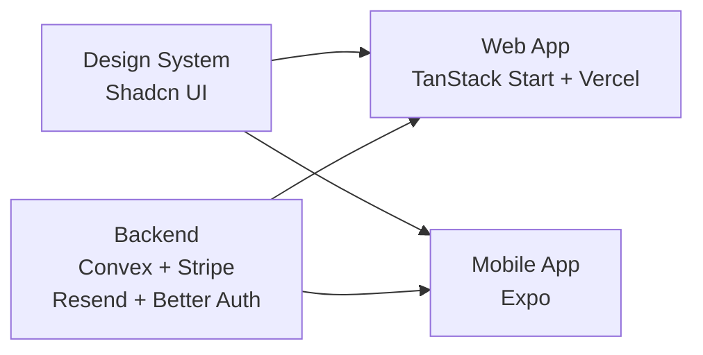
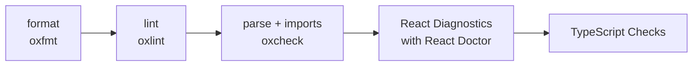

# Architecture

```mermaid
flowchart LR
  Web["Web App<br/>TanStack Start + Vercel"]
  Mobile["Mobile App<br/>Expo"]
  Backend["Backend<br/>Convex + Stripe<br/>Resend + Better Auth"]
  UI["Design System<br/>Shadcn UI"]

  UI --> Web
  UI --> Mobile
  Backend --> Web
  Backend --> Mobile
```

## AI Setup

- **Skills:** 73 skills: root 3, web 9, mobile 39, backend 21, UI 1.
- **MCPs:** 5 mcp: Convex, Better Auth, Stripe, shadcn, Vercel.

## Quality Gate

```mermaid
flowchart LR
  Format["format<br/>oxfmt"]
  Format --> Lint["lint<br/>oxlint"]
  Lint --> Oxc["parse + imports<br/>oxcheck"]
  Oxc --> Doctor["React Diagnostics<br/>with React Doctor"]
  Doctor --> Types["TypeScript Checks"]
```
