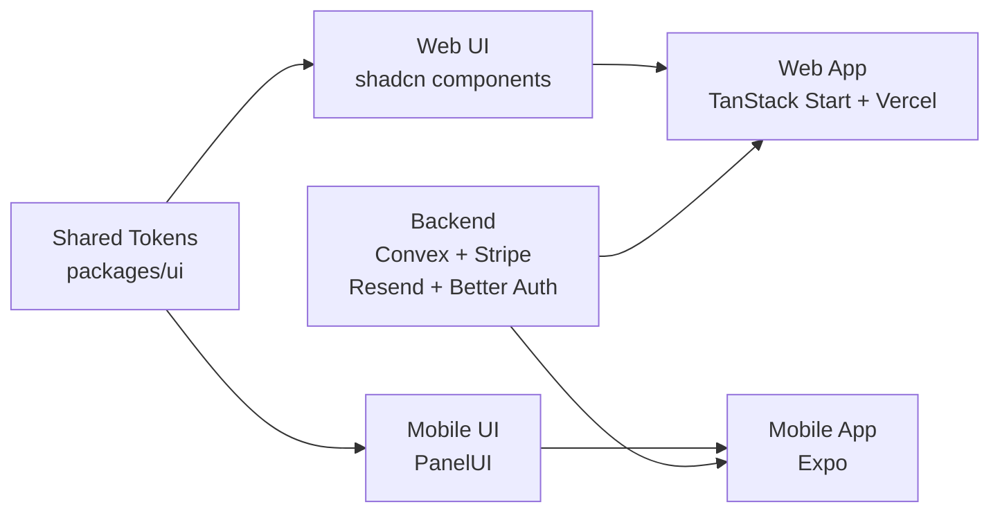
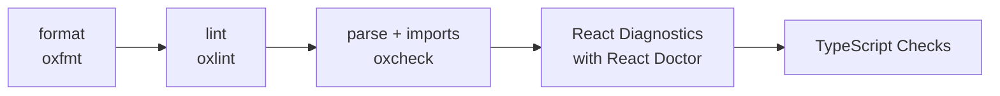

# Architecture

## Design System Flow

- `packages/ui/src/tokens/design-tokens.json` is the shared token source.
- `packages/ui/src/components` contains web-only shadcn components.
- Mobile imports components from `panelui-native`; it does not convert or mirror
  web components.
- `pnpm sync:design-system` regenerates shared CSS tokens, the PanelUI mobile CSS
  entry, and navigation theme values. It does not generate mobile components.
- Create app-specific mobile components only when PanelUI has no suitable
  component.

## AI Setup

- Skills are scoped under each workspace's `.agents/skills` directory.
- Configured MCPs cover Convex, Better Auth, Stripe, shadcn, and Vercel.

## Quality Gate

## Set Up

- replace `name-of-project` in the codebase
- run `pnpm update:deps` and `pnpm update:skills`
- apply a web theme with
  `pnpm dlx shadcn@latest apply --preset [preset-id] --cwd apps/web --yes`
- run `pnpm sync:design-system` to propagate shared tokens to web and mobile
