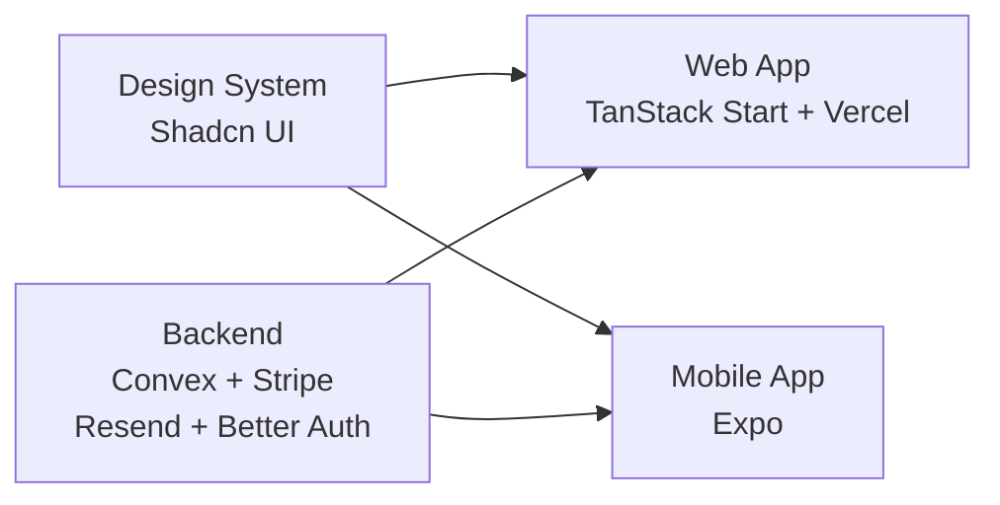
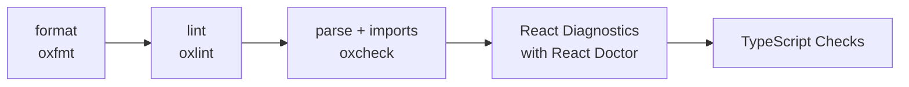

# Architecture

## AI Setup

- **Skills:** 76 skills: root 3, web 10, mobile 40, backend 22, UI 1.
- **MCPs:** 5 mcp: Convex, Better Auth, Stripe, shadcn, Vercel.

## Quality Gate

## Set Up

- replace `project-name` in the codebase
- run `pnpm update:deps` and `pnpm update:skills`
- apply theme with `pnpm dlx shadcn@latest apply --preset [preset-id] --cwd apps/web --yes` then `pnpm sync:design-system`
