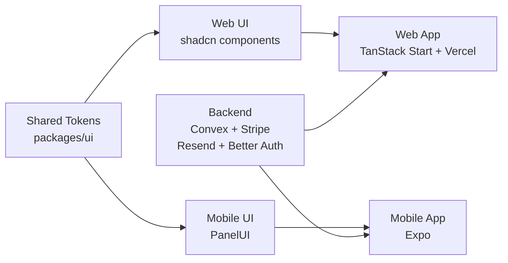
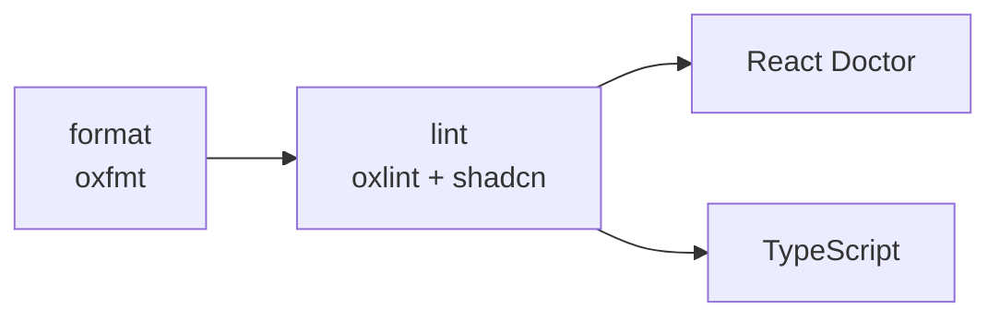

# Architecture

```mermaid
flowchart LR
  Web["Web App<br/>TanStack Start + Vercel"]
  Mobile["Mobile App<br/>Expo"]
  Backend["Backend<br/>Convex + Stripe<br/>Resend + Better Auth"]
  Tokens["Shared Tokens<br/>packages/ui"]
  WebUI["Web UI<br/>shadcn components"]
  MobileUI["Mobile UI<br/>PanelUI"]

  Tokens --> WebUI --> Web
  Tokens --> MobileUI --> Mobile
  Backend --> Web
  Backend --> Mobile
```

## Design System Flow

- `packages/ui/src/styles/globals.css` holds the shared shadcn tokens.
- Web uses shadcn components from `packages/ui`; mobile uses PanelUI.
- `pnpm sync:design-system` copies the tokens to `apps/mobile/tokens.css`.

## AI Setup

- Skills are scoped under each workspace's `.agents/skills` directory.
- Configured MCPs cover Convex, Better Auth, Stripe, shadcn, and Vercel.

## Quality Gate

Run `pnpm fix` for all checks, or `pnpm exec oxlint .` for linting only.

- Oxlint enforces correctness, type safety, React, and accessibility rules.
- `@shadcn/lint` keeps web and mobile on the design system: theme colors, scale
  values, known Tailwind classes, static classes, and no inline styles. Web
  consumers of shared components may only add layout classes; appearance
  belongs in component variants. Vendored shadcn sources in
  `packages/ui/src/components` are exempt from style-only rules.
- React Doctor (`doctor.config.json`) adds React-specific checks on top of
  Oxlint without repeating its rules.

```mermaid
flowchart LR
  Format["format<br/>oxfmt"]
  Format --> Lint["lint<br/>oxlint + shadcn"]
  Lint --> Doctor["React Doctor"]
  Lint --> Types["TypeScript"]
```

## Set Up

- replace `name-of-project` in the codebase
- run `pnpm self-update` and `pnpm update:deps`
- apply a web theme with
  `pnpm dlx shadcn@latest apply --preset [preset-id] --cwd apps/web --yes`
- run `pnpm sync:design-system` to propagate shared tokens to web and mobile
